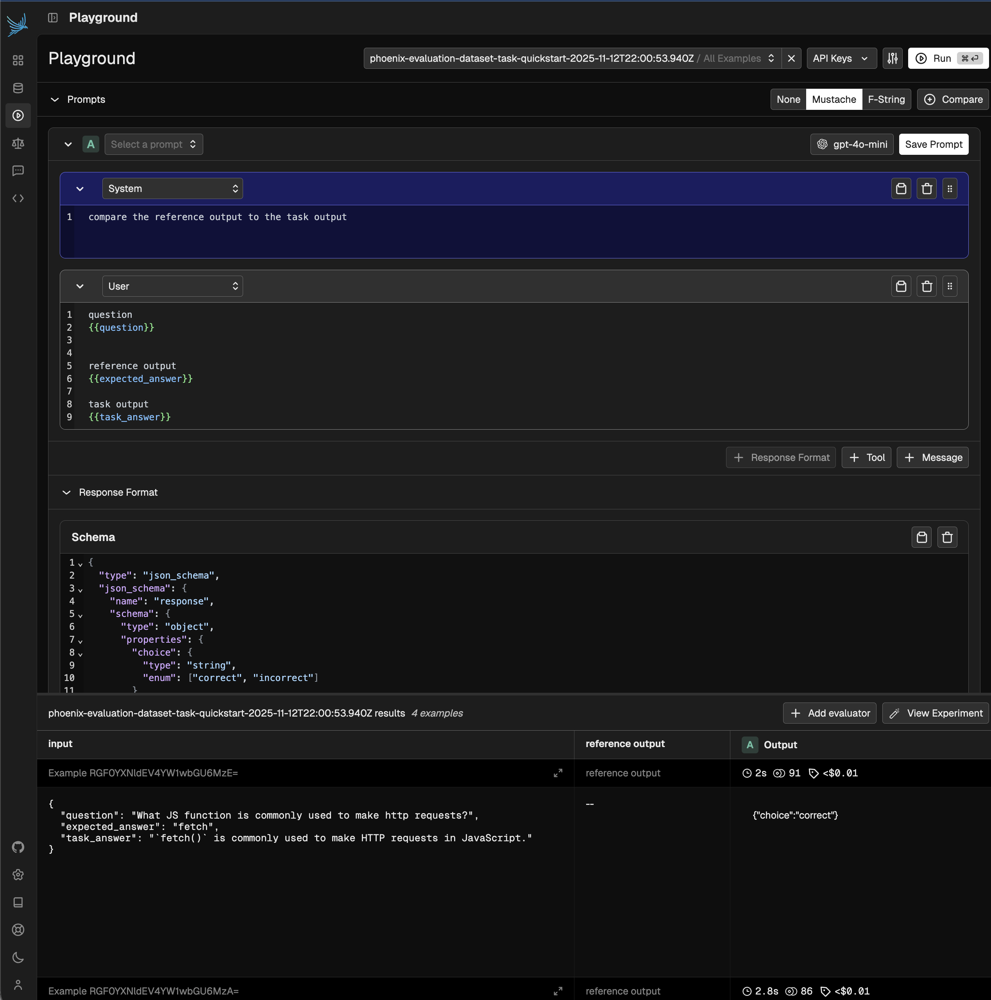

# Phoenix Dataset Task Quickstart

This is a quickstart using the Phoenix SDK to create a dataset and a task, run an experiment, and apply the task outputs into a new dataset for evaluation.

It will produce a dataset with factual inputs and outputs, then it will invoke
an llm to answer the inputs (without knowing the answers), and finally a new dataset will be created with the original inputs combined with the llm outputs.



## Usage

Start Phoenix locally (or use https://app.phoenix.arize.com):

```bash
docker start arize-phoenix 2>/dev/null || \
  docker run --pull=always -d --name arize-phoenix --rm \
  -p 6006:6006 \
  # uncomment this if you do not want to persist phoenix data
  # -e PHOENIX_SQL_DATABASE_URL="sqlite:///:memory:" \
  arizephoenix/phoenix:latest
```

Configure environment variables:

```bash
cp .env.example .env
# now edit .env
```

Install dependencies:

```bash
pnpm install
```

Run the quickstart:

```bash
# ensure you are running node 24
# if you have nvm, run `nvm use`
pnpm start
```
